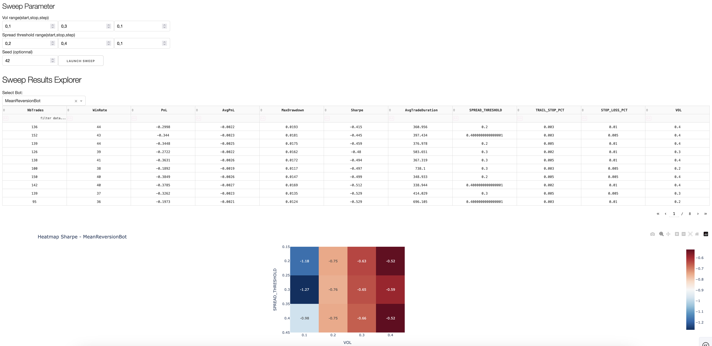

> [Version française ici](README_fr.md)  
> [Versión castellano acá](Readme_es.md)

# C++ Backtest Engine & Sweep Dashboard

A compact simulation engine for testing trading strategies using synthetic data, coupled with a fully interactive Python dashboard for real-time parameter tuning and analysis.

## Preview

### Live Simulation


### Sweep Dashboard


## Goal

- Practice **C++** for low-latency simulation logic  
- Learn **Dash / Plotly** for building analytical UIs  
- Explore **parameter optimization**, via grid sweeps  
- Serve as a foundation for more advanced projects (L2 book, MM agent, etc.)

---

## Project Structure

```
cpp-backtester-engine/
├── sim                 # C++ trading engine (compiled binary)
├── config.txt          # Simulation parameters (auto-overwritten)
├── data/               # Output files: market.csv, *_trades.csv          
├── scripts/
│   ├── dash_app.py     # Dashboard interface (live sim + sweep explorer)
│   └── sweeper.py      # Grid search engine (multithreaded)
|   └── results/        # Output CSVs from sweep metrics
├── include/            # C++ headers
├── src/                # C++ source files
└── Makefile            # Build the sim binary (run: `make`)
```

---

## Simulation Engine (C++)

The core engine simulates a Geometric Brownian Motion price process and executes trading logic at each tick.

Strategies implemented:
- **SpreadBot**: basic spread scalper, exits instantly
- **MeanReversionBot**: enters on price reversion ±2σ, exits on trailing stop
- **MovingAverageCrossoverBot**: triggers on short vs. long SMA cross

Simulation is run in "live ticks" (10ms default), or accelerated via `-t N`.

```bash
./sim -t 10000 --config config.txt --output metrics.csv
```

---

## Dash Interface (Python)

Launch `dash_app.py` to start the dash app, then open it on your web browser.

```bash
python3 scripts/dash_app.py
```

### Tabs

- **Live Simulation**: adjust strategy parameters and observe market evolution + trades
- **Parameter Sweep**:
  - Launch parallel grid sweeps over `SPREAD_THRESHOLD`, `VOL`, etc.
  - Inspect results in sortable tables
  - Explore heatmaps of Sharpe ratio, PnL...

---

## Parameter Sweeping

The sweeper script runs `sim` in parallel across combinations of parameters.

```bash
python3 scripts/sweeper.py \
  --vol-start 0.1 --vol-stop 0.3 --vol-step 0.1 \
  --spread-start 0.2 --spread-stop 0.4 --spread-step 0.1 \
  --seed 42
```

Result CSVs are stored in `/scripts/results/`, and merged into `/scripts/sweep_results.csv`.

---

## Mathematical Model

Price is simulated using **Geometric Brownian Motion (GBM)**:

Continuous form:

```
dS_t = μ S_t dt + σ S_t dW_t
```

Discretized form (Euler):

```
S_{t+1} = S_t × exp[(μ - 0.5 σ²) × Δt + σ × √Δt × ε]
```

Where:
- `μ`: drift (expected return)
- `σ`: volatility
- `ε ~ N(0, 1)` : standard Gaussian noise

---

## Strategy Logic

### Bollinger Mean Reversion (MRB)
Entry when price deviates 2σ above/below rolling mean.  
Exit on:
- Reversion toward mean
- Trailing stop
- Stop loss

Rolling metrics used:

```math
μ = (1 / n) × Σ x_i

σ = sqrt[(1 / (n - 1)) × Σ (x_i - μ)²]
```

More: [Wikipedia - Bollinger Bands](https://en.wikipedia.org/wiki/Bollinger_Bands)

---

## Setup & Dependencies

- Python ≥ 3.8
- `dash`, `pandas`, `plotly`, `numpy`
- C++ compiler (g++ / clang++)
- `make`

Install Python deps:

```bash
pip install -r requirements.txt
```

Build C++ sim:

```bash
    make
```

---

## Next Steps (Ideas)

- Add L2 order book structure
- Realistic fill simulation (partial, latency-based)
- Plug real market data (Binance/Polygon API)
- ML-based strategy (RL agent or regression on Sharpe)
- Connect to QuantLib or real option data

---

## Author

Built as a personal side project to deepen understanding of HFT architecture, backtesting structure, and dashboarding.  
Ready to extend into real-time or research-oriented use cases.
